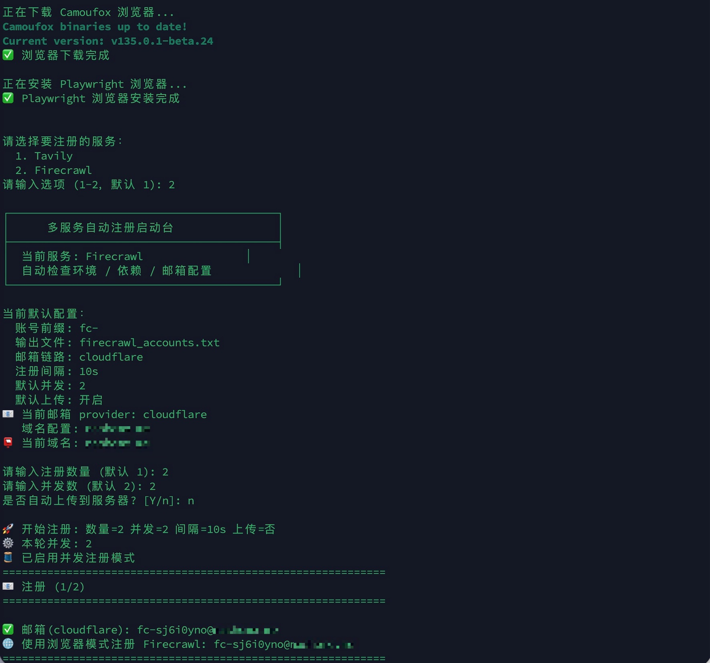
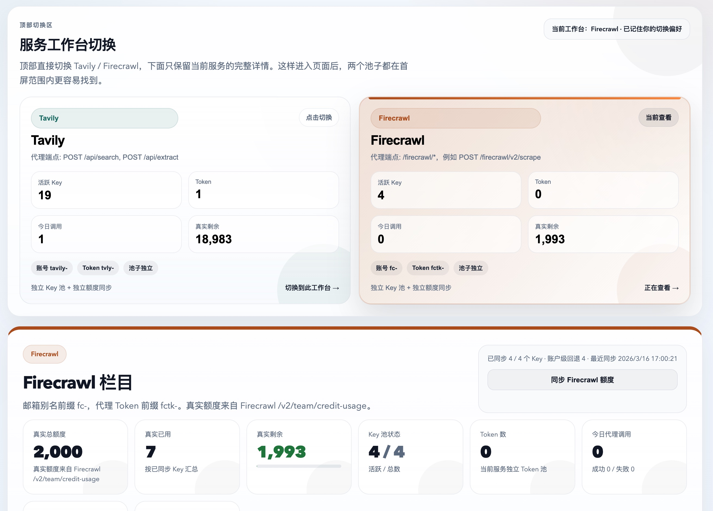

# API Key Generator - Multi-Service Edition

[English Guide](./README_EN.md)

这是现在这套真正可用的多服务注册器，已经把 **Tavily** 和
**Firecrawl** 放进同一个启动台：

- **Tavily**：AI 搜索 API
- **Firecrawl**：网页抓取 API

和早期零散脚本不一样，这版已经统一收口到一条稳定链路：

- 本地真实浏览器注册
- Tavily 本地 Turnstile Solver
- 邮箱 API 自动收验证码 / 验证链接
- 提取到 API Key 后立刻做真实调用验证
- 可选自动上传到多服务代理池

目标很直接：把 Tavily / Firecrawl 的注册、验证、落盘、上传全部放到一套真正能长期跑的工作流里。

Cloudflare 通用无限别名域名邮箱教程见：
[Cloudflare 邮件设置详解](./docs/Cloudflare%E9%82%AE%E4%BB%B6%E8%AE%BE%E7%BD%AE%E8%AF%A6%E8%A7%A3.md)

英文版说明见：
[Cloudflare Mail Setup Guide](./docs/Cloudflare-Mail-Setup-Guide.md)

## Features

- 多服务启动台：启动时直接选择 Tavily 或 Firecrawl
- 自动环境准备：自动检查 `venv`、依赖和浏览器
- 邮箱链路统一：支持 Cloudflare Mail API 和 DuckMail
- 多域名可选：启动时选择本轮注册用的域名
- 并发注册：支持批量和并发执行
- 后台浏览器模式：默认 headless，必要时可切前台排查
- 真实可用性验证：拿到 key 后马上调用官方接口
- 自动上传到代理池：上传时会带上服务标记，服务器能自动识别 Tavily / Firecrawl 并写入各自池子
- 代理控制台：支持独立 Key 池、独立 Token 池和真实额度同步
- 跨平台启动：Windows / macOS / Linux 都能直接跑

## Screenshots

### 多服务启动台



### 并发注册与真实验证


### Proxy 工作台切换



### Proxy Key 池详情


## Quick Start

### 1. Clone

```bash
git clone https://github.com/skernelx/tavily-key-generator.git
cd tavily-key-generator
```

### 2. Configure

```bash
cp .env.example .env
```

编辑 `.env`，填好你的邮箱链路和可选上传配置。

### 3. Run

macOS / Linux:

```bash
python3 run.py
```

或：

```bash
./start_auto.sh
```

Windows:

```bat
start_auto.bat
```

## How It Works

程序启动后会自动执行：

1. 选择要注册的服务（Tavily / Firecrawl）
2. 创建或复用 `venv`
3. 安装 Python 依赖
4. 安装 Camoufox / Playwright 浏览器依赖
5. 读取 `.env`
6. 检查邮箱 provider 配置
7. 如果配置了多个域名，提示选择本轮使用的域名
8. 输入注册数量
9. 输入并发数
10. 选择是否自动上传到服务器
11. 如果是 Tavily，自动启动本地 Solver
12. 自动处理邮箱验证码与密码设置
13. 遇到随机 challenge 时自动恢复（Tavily）
14. 提取 API Key
15. 真实调用 API 验证
16. 保存到 `accounts.txt` 或 `firecrawl_accounts.txt`
17. 如已开启上传，则继续上传到服务器

## Runtime Flow

```text
run.py
  -> choose service (Tavily / Firecrawl)
  -> load .env
  -> choose domain
  -> input count / concurrency
  -> choose upload or not
  -> [Tavily only] start Turnstile Solver
  -> create mailbox
  -> open signup page
  -> [Tavily only] solve Turnstile locally
  -> receive email verification link
  -> set password
  -> [Tavily only] recover random password-page challenge
  -> enter dashboard
  -> extract API key
  -> verify API key with real API call
  -> save / upload
```

## Configuration

完整配置示例见 [`.env.example`](./.env.example)。

### Cloudflare Mail API

```env
EMAIL_PROVIDER=cloudflare
EMAIL_API_URL=https://your-mail-api.example.com
EMAIL_API_TOKEN=replace-with-your-token
EMAIL_DOMAIN=example.com
EMAIL_DOMAINS=example.com,example.org
```

说明：

- 单域名可只填 `EMAIL_DOMAIN`
- 多域名可填 `EMAIL_DOMAINS`
- 启动时会提示选择本轮使用的域名

### DuckMail API

```env
EMAIL_PROVIDER=duckmail
DUCKMAIL_API_URL=https://api.duckmail.sbs
DUCKMAIL_API_KEY=
DUCKMAIL_DOMAIN=
DUCKMAIL_DOMAINS=
```

说明：

- 可使用单域名或多域名配置
- 如果你有 DuckMail 私有域名和 API Key，直接填入即可
- 公开 DuckMail 域名可以测试收信链路，但不保证能通过 Tavily 风控

### Upload to Your Server

```env
SERVER_URL=https://your-server.example.com
SERVER_ADMIN_PASSWORD=replace-with-your-admin-password
DEFAULT_UPLOAD=true
```

说明：

- `DEFAULT_UPLOAD=true` 表示启动台默认开启自动上传
- 真正是否上传，仍以本轮启动时的选择为准
- 上传到代理服务器时会带 `service` 字段
- Tavily 会自动进入 Tavily 池，Firecrawl 会自动进入 Firecrawl 池

### Runtime Options

```env
DEFAULT_COUNT=1
DEFAULT_CONCURRENCY=2
DEFAULT_DELAY=10
REGISTER_HEADLESS=true
FIRECRAWL_REGISTER_HEADLESS=true
EMAIL_CODE_TIMEOUT=90
API_KEY_TIMEOUT=20
EMAIL_POLL_INTERVAL=3
SOLVER_PORT=5073
SOLVER_THREADS=1
```

说明：

- `REGISTER_HEADLESS=true` 表示浏览器后台运行
- `FIRECRAWL_REGISTER_HEADLESS` 未单独配置时会继承 `REGISTER_HEADLESS`
- 现在默认是后台运行；如果你遇到 `Security check failed`，再临时改成 `false` 用前台浏览器排查
- `SOLVER_THREADS` 最终会自动取 `max(SOLVER_THREADS, 本轮并发数)`
- 普通使用场景下不需要额外传命令参数

## Output

注册成功后，结果会写入：

**Tavily**:
```text
accounts.txt
```

**Firecrawl**:
```text
firecrawl_accounts.txt
```

格式：
```text
email,password,api_key
email,password,api_key
```

## Real-World Validation

当前主线已经做过真实回归验证：

**Tavily**:
- Cloudflare 邮箱链路可跑通完整注册
- 邮箱验证码可自动读取
- 获取到 API Key 后会立即做真实 API 调用验证
- 并发注册已做过真实回归
- 密码页随机 challenge 已补恢复逻辑，并已真测通过

**Firecrawl**:
- 邮箱验证链接可自动读取
- 支持自动登录和 API Key 提取
- API Key 验证通过真实 API 调用

## Known Limitations

### DuckMail Public Domains

DuckMail 公开域名当前的状态是：

- 创建邮箱可以
- 接收 6 位验证码可以
- 但 Tavily 在密码页可能直接风控拦截

常见页面提示：

```text
Suspicious activity detected
```

如果你要跑通完整注册，建议优先使用：

- Cloudflare 自定义域名邮箱
- DuckMail 私有域名 + API Key

### First Run on New Machine

首次换机器运行时，建议先单账号跑通一遍，再开并发。

因为首次运行会自动下载浏览器依赖，且不同机器的本地网络环境、代理环境、系统依赖可能不同。

## Project Structure

```text
.
├── run.py                       # 唯一推荐入口
├── tavily_core.py               # Tavily 注册入口
├── tavily_browser_solver.py     # Tavily 浏览器注册主逻辑
├── firecrawl_core.py            # Firecrawl 注册入口
├── firecrawl_browser_solver.py  # Firecrawl 浏览器注册主逻辑
├── api_solver.py                # 本地 Turnstile Solver（Tavily 专用）
├── mail_provider.py             # 邮箱 provider 抽象
├── config.py                    # .env / 环境变量读取
├── start_auto.sh                # macOS / Linux 启动脚本
├── start_auto.bat               # Windows 启动脚本
├── proxy/                       # 可选的多服务代理（Tavily / Firecrawl）
└── README.md
```

## Module Notes

仓库里有一些不是主入口、但仍然是运行时依赖的模块：

- `tavily_core.py`
  现在是兼容层，负责把统一入口转发到浏览器注册主链路。

- `browser_configs.py`
  `api_solver.py` 的浏览器配置辅助模块。

- `db_results.py`
  `api_solver.py` 的结果存储辅助模块。

- `proxy/`
  独立可选模块，用于把 Tavily / Firecrawl 分别做成统一代理池。

## Optional Proxy Service

如果你希望把注册出来的 key 接成统一池子，可以使用 `proxy/`。
现在它已经支持 Tavily 和 Firecrawl 两套独立池子、独立 Token 与独立额度同步。

启动方式：

```bash
cd proxy
docker compose up -d
```

详细说明见 [`proxy/README.md`](./proxy/README.md)。

## Recommended Usage

如果你只是想批量拿 key，最简单的使用方式就是：

1. 配好 `.env`
2. 运行 `python3 run.py`
3. 选择服务（Tavily / Firecrawl）
4. 选择域名
5. 输入注册数量
6. 输入并发数
7. 看 `accounts.txt` 或 `firecrawl_accounts.txt`

如果你有自己的 key 池服务器，再把自动上传或者 `proxy/` 接上即可。

## Disclaimer

本项目仅供自动化测试、研究和个人学习使用。

请自行评估目标站点的服务条款、风控策略和账号使用风险。
